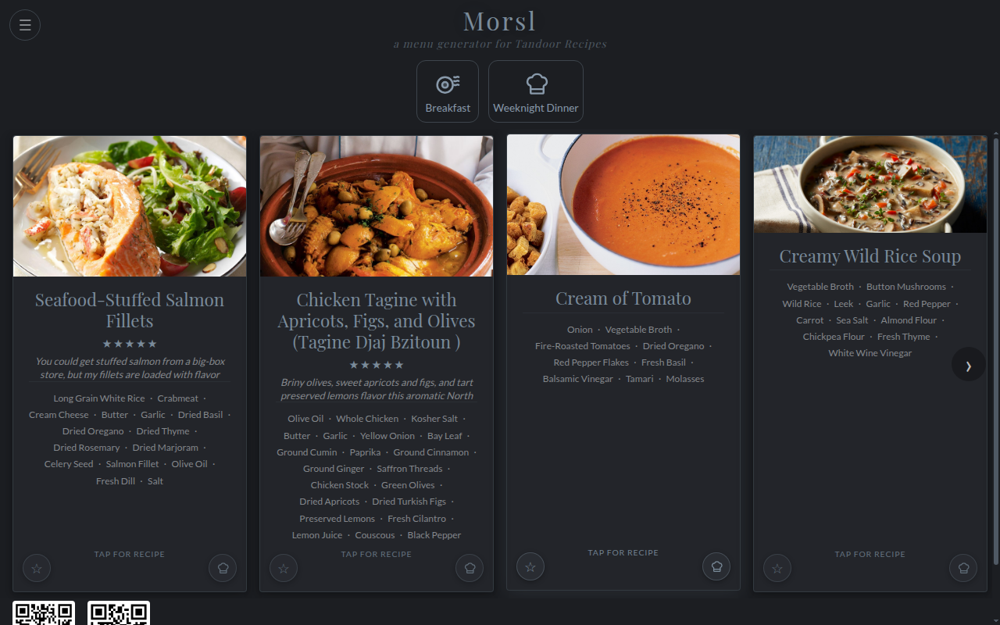
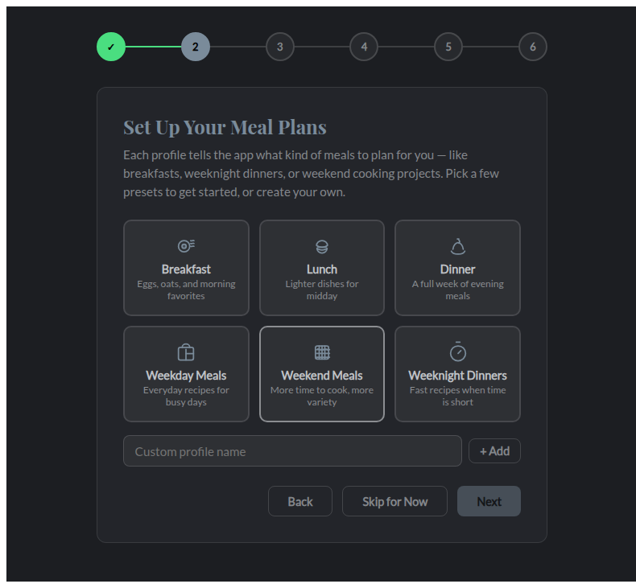
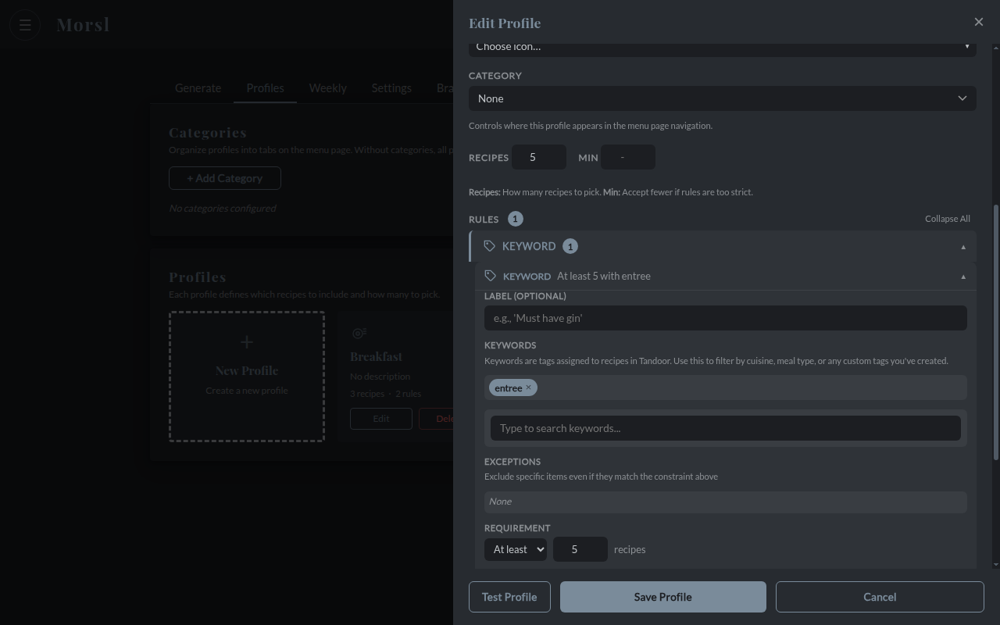
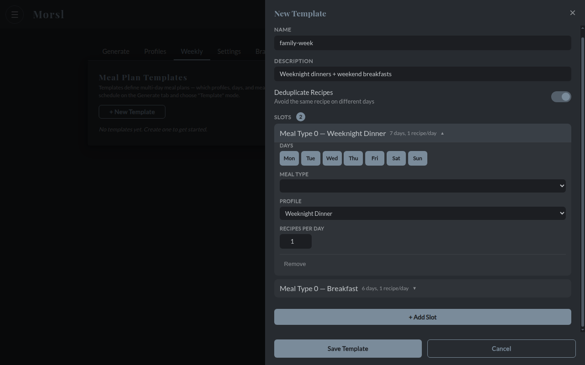
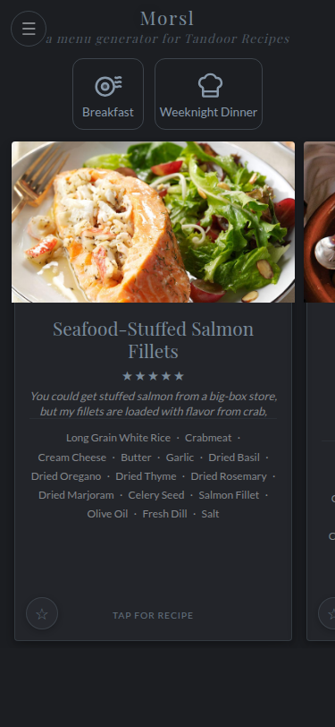
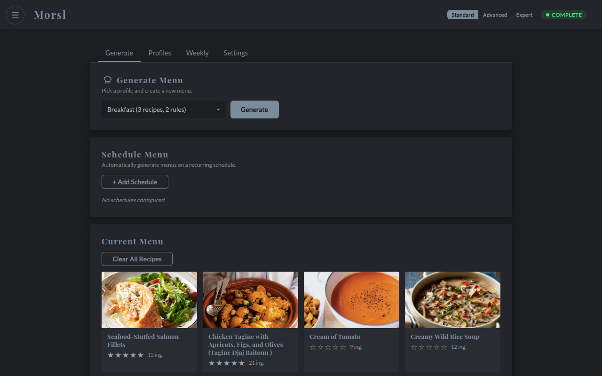

# Morsl

**Generate weekly menus from your Tandoor Recipes collection.**

Morsl connects to your [Tandoor Recipes](https://github.com/TandoorRecipes/recipes) instance, picks recipes based on your preferences (keywords, ratings, ingredients, cook history), and serves a menu your household can browse and order from. Selections sync back to Tandoor as meal plans.

[](https://github.com/featurecreep-cron/morsl/actions/workflows/ci.yml)
[](https://codecov.io/gh/featurecreep-cron/morsl)
[](https://scorecard.dev/viewer/?uri=github.com/featurecreep-cron/morsl)
[](LICENSE)
[](https://github.com/featurecreep-cron/morsl/releases)
[](https://www.python.org/downloads/)
[](https://github.com/astral-sh/ruff)
[](https://github.com/featurecreep-cron/morsl/pkgs/container/morsl)

---



---

## What You Need

- A running [Tandoor Recipes](https://docs.tandoor.dev) instance
- A Tandoor API token (in Tandoor: **Settings > API Tokens > Create** — just click Create and copy the token string)
- Docker installed on your server

## Quick Start

### Docker Compose (recommended)

Create a `docker-compose.yml`:

```yaml
services:
  morsl:
    image: ghcr.io/featurecreep-cron/morsl:latest
    ports:
      - "8321:8321"
    environment:
      - TANDOOR_URL=http://your-tandoor-address:port  # e.g. http://192.168.1.50:8080
      - TANDOOR_TOKEN=your-api-token
      - TZ=America/New_York
      - PUID=1000  # match your host user: id -u
      - PGID=1000  # match your host group: id -g
    volumes:
      - morsl-data:/app/data
    restart: unless-stopped

volumes:
  morsl-data:
```

```bash
docker compose up -d
```

Open `http://your-server:8321`. The setup wizard walks you through connecting to Tandoor if you skip the environment variables.



The `data` volume keeps your profiles, schedules, branding, and settings safe across updates.

### Docker run (quick test)

```bash
docker run -d --name morsl \
  -e TANDOOR_URL=http://your-tandoor-address:port \
  -e TANDOOR_TOKEN=your-api-token \
  -p 8321:8321 \
  ghcr.io/featurecreep-cron/morsl:latest
```

**Note:** Without a volume mount (`-v`), your settings are lost when the container restarts. Use Docker Compose for anything permanent.

### Updating

```bash
docker compose pull && docker compose up -d
```

Your data (profiles, schedules, branding, settings) is stored in the volume and survives updates.

---

## How It Works

1. **Create profiles** in the admin panel (`/admin`). Each profile defines what kind of recipes to pick — "Weeknight Dinner" might require the keyword "entree" and prefer 4+ star recipes. "Breakfast" might pick 3 recipes tagged "breakfast."
2. **Generate a menu.** Morsl picks recipes that match your rules. If your rules are too strict, it picks fewer recipes rather than giving you nothing.
3. **Share the menu.** Your household opens `http://your-server:8321` on their phone or computer — no accounts needed. They browse recipe cards, see photos and ingredients, and tap to order.
4. **Orders appear** instantly in the admin panel. You can sync selections back to Tandoor as meal plan entries with one click.

---

## Features

- **Multiple profiles** — "Weeknight Dinner," "Breakfast," "Weekend Projects" — each with its own rules



- **Smart filtering** — filter by keywords, minimum rating, ingredients, date ranges, recipe books. Rules can be strict (must match) or flexible (prefer but don't require)
- **Household menu** — shareable page where your family browses and orders, no accounts needed
- **Live order notifications** — the admin panel updates instantly when someone places an order
- **Tandoor meal plan sync** — push selections back to Tandoor
- **Weekly plans** — plan your whole week: assign different profiles to different days and meals. Monday breakfast from "Quick Breakfast," Monday dinner from "Weeknight Dinner," Saturday dinner from "Weekend Projects" — all generated at once


- **Scheduled generation** — automatic menu refresh on a schedule
- **Custom branding** — your own logo, favicon, app name, and slogans
- **Mobile-friendly** — responsive layout, QR codes for easy sharing from desktop
- **Setup wizard** — guided 6-step configuration, no config files required
- **Works with any recipe collection** — even if your recipes aren't tagged or rated, Morsl still picks from them. Tags and ratings just give you more control.



---

## Configuration

### Environment variables

| Variable | Default | Description |
|----------|---------|-------------|
| `TANDOOR_URL` | *(none)* | Your Tandoor instance URL |
| `TANDOOR_TOKEN` | *(none)* | Tandoor API token |
| `TZ` | `UTC` | Timezone for schedules and meal plans |
| `LOG_LEVEL` | `INFO` | Log verbosity (`DEBUG`, `INFO`, `WARNING`, `ERROR`) |
| `LOG_TO_STDOUT` | `1` (Docker) | Send logs to stdout instead of file |
| `PUID` | `1000` | User ID for file ownership (see below) |
| `PGID` | `1000` | Group ID for file ownership (see below) |

Both `TANDOOR_URL` and `TANDOOR_TOKEN` can also be configured through the setup wizard.

The API token needs read access to recipes, keywords, and books. If you want to sync orders back to Tandoor as meal plans, it also needs write access to meal plans. Tandoor tokens have full access by default, so a freshly created token works.

### Admin panel

Everything is configured through the admin UI at `/admin`:



- **Generate** — pick a profile, generate a menu, set up automatic schedules
- **Profiles** — create and edit profiles with filtering rules
- **Weekly** — build multi-day menu templates (different profiles per day and meal type)
- **Settings** — branding, Tandoor connection, data management

Three complexity tiers (Standard / Advanced / Expert) progressively show more options. Start with Standard — it covers most use cases.

API documentation is available at `/docs` (interactive) and `/redoc` (reference).

### Security

Morsl has no built-in authentication by default. If you're only using it at home on your local network, this is fine. The optional admin PIN (Settings) keeps household members out of the admin panel — it is **not** a substitute for real authentication.

If you're exposing Morsl to the internet, put it behind a reverse proxy with proper authentication (Authelia, Authentik, Cloudflare Access, etc.).

**Forgot your PIN?** Two options:

1. **Script** — run inside the container:
   ```bash
   docker exec morsl python scripts/reset-pin.py
   ```

2. **Manual** — edit `settings.json` in your data volume directly:
   ```json
   {
     "pin": "",
     "admin_pin_enabled": false,
     "kiosk_pin_enabled": false
   }
   ```

Either way, restart the container afterward, then set a new PIN from admin settings.

---

## Development

<details>
<summary>For contributors and developers</summary>

Requires Python 3.12+ and system libraries for CairoSVG (`libcairo2`, `libpango-1.0-0`).

```bash
pip install -e ".[dev]"
pytest
```

200+ tests covering the solver, services, API routes, models, and utilities. Integration tests requiring a live Tandoor instance are marked `@pytest.mark.integration` and skipped by default.

### Tech stack

- **Backend**: FastAPI, Pydantic, uvicorn
- **Solver**: PuLP with CBC (COIN-OR) — linear programming for recipe selection
- **Frontend**: Vanilla JS with Alpine.js, no build step
- **Scheduling**: APScheduler 3.x
- **Container**: python:3.12-slim (Debian), multi-arch (amd64 + arm64), auto-release pipeline

The Docker image uses `python:3.12-slim` rather than Alpine because CairoSVG and Pango require system libraries that are simpler to install on Debian.

The image runs as UID 1000 by default. Set `PUID` and `PGID` environment variables to match your host user — no rebuild needed. This follows the [linuxserver.io convention](https://docs.linuxserver.io/general/understanding-puid-and-pgid/).

### Project structure

```
morsl/                         # Python package
├── __init__.py
├── solver.py                  # PuLP-based recipe picker
├── models.py                  # Domain models
├── tandoor_api.py             # Tandoor API client
├── constants.py               # Configuration constants
├── utils.py                   # Shared utilities
├── app/                       # FastAPI application
│   ├── main.py                # Lifespan, middleware, page routes
│   ├── config.py              # Pydantic Settings
│   └── api/
│       ├── dependencies.py    # DI singletons, auth
│       ├── models.py          # Request/response schemas
│       └── routes/            # API endpoints
└── services/                  # Business logic layer
web/                           # Frontend (vanilla JS, Alpine.js)
tests/                         # 200+ tests
Dockerfile
docker-compose.yml
```

</details>

---

## Support

- [File an issue](https://github.com/featurecreep-cron/morsl/issues) on GitHub
- [Buy me a coffee](https://buymeacoffee.com/featurecreep)
- Built by [Cron](https://featurecreep.dev)

## License

[MIT](LICENSE)
